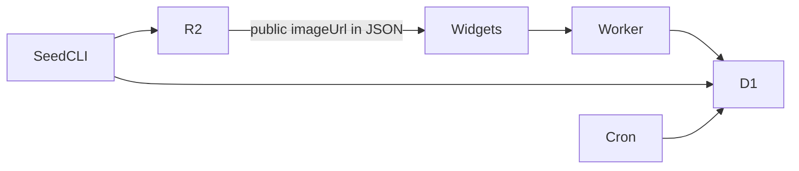

# poke-api

A small **Pokédex HTTP API** used mainly by iPhone widgets. It returns Pokémon detail JSON (types, abilities, stats, locations, dominant color, image URL).

Originally ran on **Deno Deploy** (Oak + Deno KV + Lume docs). After that project was removed in a platform migration, it was rewritten as a **Cloudflare Worker** with **Hono**, **D1** for data, and **R2** for source JSON / public images.

## Live

- Worker: [https://poke-api.anuragroy.workers.dev](https://poke-api.anuragroy.workers.dev)
- Repo: [anurag-roy/poke-api](https://github.com/anurag-roy/poke-api)

## Stack (current)

- Runtime: Cloudflare Workers (`nodejs_compat`)
- Framework: [Hono](concepts/hono.md)
- Data: [D1](entities/d1-database.md) (`pokemon` + `meta`)
- Assets / seed source: [R2 `pokeapi`](entities/r2-pokeapi.md)
- Deploy: Wrangler + [GitHub Actions](entities/github-actions.md)

## API (stable surface)

See [API surface](concepts/api-surface.md). Widgets depend on these paths and the full detail object shape.

## Mental model

Runtime path is **Worker → D1 only**. R2 is for seeding and for public `.webp` URLs embedded in stored JSON.

## Related

- [Architecture](concepts/architecture.md)
- [Seed pipeline](concepts/seed-pipeline.md)
- [Pokémon of the Day](concepts/pokemon-of-the-day.md)
- [Data model](concepts/pokemon-data-model.md)
